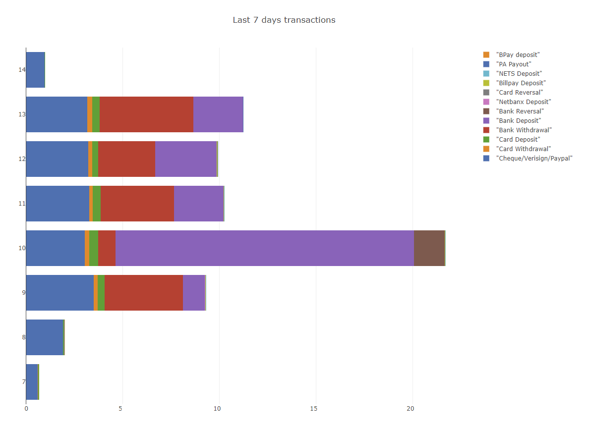

## About

Some F# code combined with Plotly for graphing some payment transactions.

- [XPlot.Plotly](https://www.nuget.org/packages/XPlot.Plotly/)
- [FSharp.Data.SqlProvider](https://fsprojects.github.io/SQLProvider/) *Not be confused with [FSharp.Data.TypeProviders](http://fsprojects.github.io/FSharp.Data.TypeProviders/sqldata.html) which ships with FSharp*
- [FSharp.Configuration](https://github.com/fsprojects/FSharp.Configuration)

```fsharp
#r "../packages/FSharp.Plotly.1.0.3/lib/net45/FSharp.Plotly.dll"
#r "../packages/SQLProvider.1.1.11/lib/FSharp.Data.SqlProvider.dll"
#r "../packages/FSharp.Configuration.1.3.0/lib/net45/FSharp.Configuration.dll"
#r "System.Data.Linq"

#load "ChartSettings.fs"
#load "Transactions.fs"

open XPlot.Plotly
open System.Web.UI.WebControls

let numDays = ChartSettings.numDays
let dc = ChartSettings.PaymentsDb.GetDataContext(ChartSettings.Settings.ConnectionStrings.PaymentsData, 300)

let daysChart = 
  Transactions.getDaysStacks numDays dc
  |> Seq.map (fun t -> Chart.StackedBar(t.Days, t.Amounts, Name= sprintf "%A" t.Name))
  |> Chart.Combine  
  |> Chart.withLayout (
    Layout.init (
        Barmode=StyleParam.Barmode.Stack, 
        Title= sprintf "Last %i days transactions" numDays))
  |> Chart.withSize (1200,900)
  |> Chart.SaveHtmlAs "last7days" 
```

Creates something like this:


### Error

```
PS D:\Projects\fsharp\PaymentCharts\Process> dotnet build
Microsoft (R) Build Engine version 16.7.0-preview-20360-03+188921e2f for .NET
Copyright (C) Microsoft Corporation. All rights reserved.

  Determining projects to restore...
  All projects are up-to-date for restore.
  You are using a preview version of .NET. See: https://aka.ms/dotnet-core-preview
error FS3053 : The type provider 'FSharp.Configuration.ConfigTypeProvider+FSharpConfigurationProvider' reported an error
 : The type provider constructor has thrown an exception: System.Runtime.Caching is not supported on this platform. [D:\
Projects\fsharp\PaymentCharts\Process\Process.fsproj]
FSC : warning FS3005: Referenced assembly 'C:\Users\craig\.nuget\packages\fsharp.configuration\2.0.0-alpha2\lib\netstand
ard2.0\FSharp.Configuration.dll' has assembly level attribute 'Microsoft.FSharp.Core.CompilerServices.TypeProviderAssemb
lyAttribute' but no public type provider classes were found [D:\Projects\fsharp\PaymentCharts\Process\Process.fsproj]
```